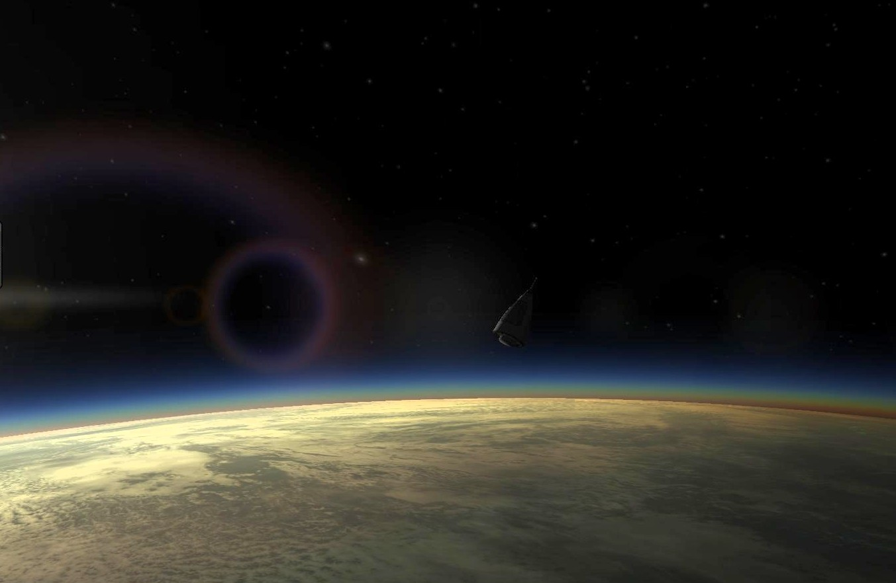

## Disordered Progression

### A very Brazilian space program

The Disordered Progression Space Program is aiming to win the wild race that started in recent years into Space. 

* [Report number 1](/reports/report-1.md) From a reconnaissance plane to a crewed sub-orbital vehicle. - UPDATED
* [Report number 2](reports/report-2) The path to orbit!

### Missions completed so far 

| Mission                                                     | Year | Month | Day | LV                                          | Payload | Destination           |
|:------------------------------------------------------------|:----:|:-----:|:---:|:--------------------------------------------|:--------|:----------------------|
| [First flight](/missions/1951-02-15-first-launch.md)  | 1951 | 2     | 15  | [Bonny]        | Bonanza | Atmospheric    |
| [To space!](/missions/1951-02-18-to-space.md)     | 1951 | 2     | 18  | [Corporal-WAC](/lvs/corporal-wac) | TPT     | Sub-Orbital           |
| [Recovery](/missions/recovery.md)     | 1951 | 3     | 7   | [Corporal-WAC R] | TPT     | Sub-Orbital           |
| [Downrange milestone](/missions/downrange.md)  | 1951 | 4     | 8   | [Bumper 100-2B]  | TPT     | Sub-Orbital           |
| [Sound Barrier](/missions/sound-barrier.md)  | 1951 | 5     | 3   | [Junk Proto] | Junkers | Atmospheric    |
| [Biome fishing](/missions/biome-sr.md)  | 1951 | 5     | 8   | [Bumper 100-2B] | TPT | Sub-Orbital         |
| [Spaaaace!](/missions/crewed-so.md)      | 1951 | 6     | 23  | [100 Crew]        | X-1     | Sub-Orbital           |
| [Space Bio](/missions/crewed-bio.md)      | 1951 |  8    |  2  | [100 Crew Bio]    | X-1     | Sub-Orbital           |
| [Uncrewed Records](/missions/sr-records.md) | 1951 | 8     | 28   | [Bumper 101-2X] | TPT | Sub-Orbital       |
| [Air Recon](/missions/plane-photo.md) | 1951 | 9     | 1   | [Bonny Recon]     | Bonanza | Atmospheric    |
| [Space Photo 1](/missions/crewed-photo1.md)  | 1951 | 9     |  26 | [100 Crew Photo]      | X-1     | Sub-Orbital           |
| [Space Photo 2](/missions/crewed-photo2.md)  | 1951 |  24   |  10 | [100 Crew Photo]      | X-1     | Sub-Orbital           |
| [X-Plane high](/missions/xplane-high.md)    | 1951 | 11    | 15  | [100 Crew Phoyo]       | X-1     | Sub-Orbital           |
| [Orbit!!!](/missions/first-orbit.md)  | 1952 | 4     | 9   | [Bumper 100-2B] | TPT     | Sub-Orbital           |

### Technology already developed:

1. Supersonic plane development - May 1951
1. Post-War Rocketry tests - ~June 1951
1. Tracking Systems - ~June 1951
1. Early Rocketry - ~July 1951
1. Basic Rocketry - ~September 1951
1. Avionics Prototypes - ~November 1951
