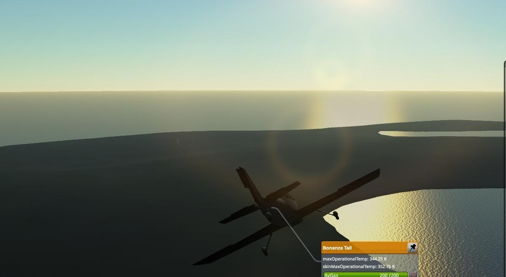

## Our Journey begins!

### 15-02-1951
To officially inaugurate our space program, we acquired a basic recoinassance airplane to make an flight around
NASC, our Northern Alcantara Space Center. It acquired some meteorological data from the surroundings and showed the cappability of our amazing runway, which will be used by experimental Supersonic flights at a later date.
This provided us with valuable data (~13 science :P) to recognize the need for the development of a high-altitude capable cockpit, as well as improvements in our rockets and tracking systems if we want to launch anything beyond the simple sounding rockets already designed and under construction

