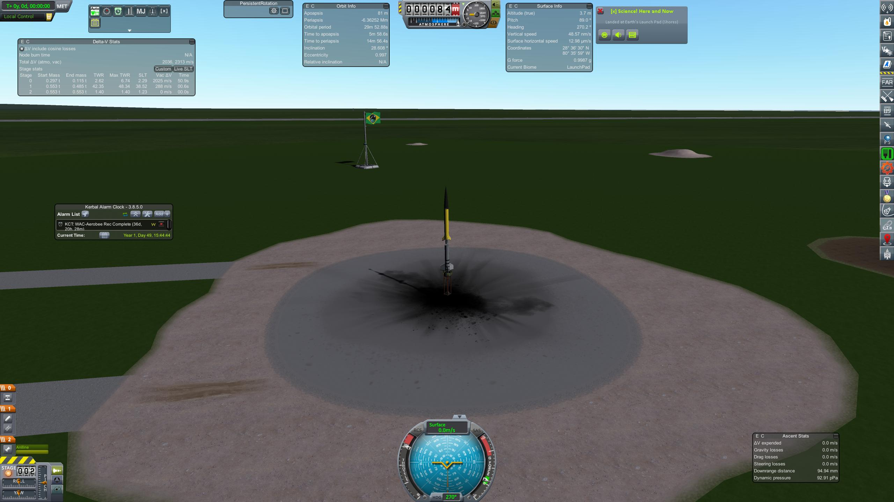

## Higher than ever

### 18 - 02 - 1951
|          |                |
|----------|----------------|
| **Destination** | Sub-Orbital |
| **Mission duration** | Minutes |
| **Apogee:**| above 140 km |
| **Downrange distance:** | ~30 km |
| **Maximum velocity** | not measured |

First flight into space, with a [Corporal-WAC](../lvs/corporal-wac), a simple WAC-corporal sustainer boosted by a  Tiny Tim missile to get it out of the pad.
It reached 147km of altitude, and obtained valuable information about the environment in space.

