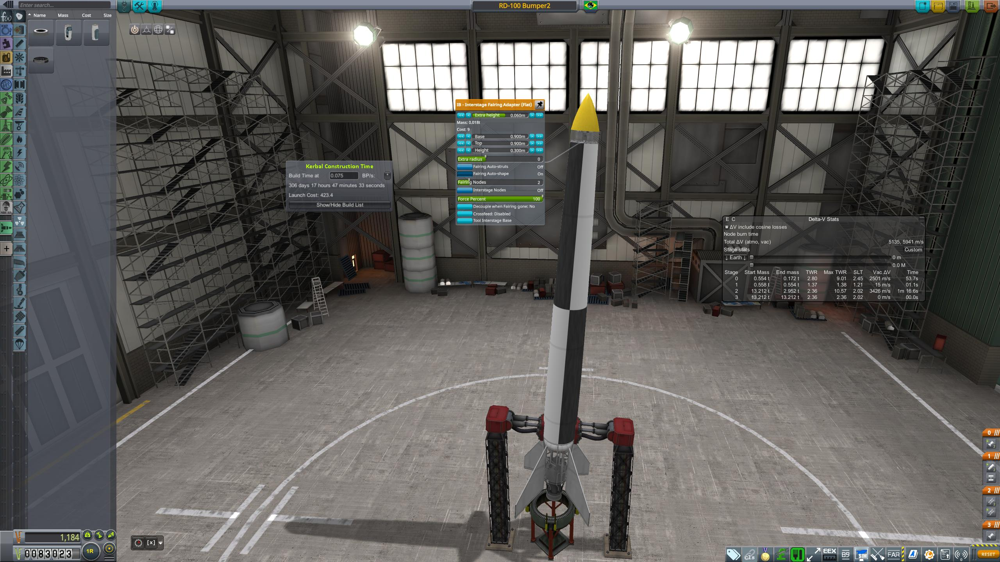

### 08 - 05 - 1951

|          |                |
|----------|----------------|
| **Launcher:** | [Bumper 100-2B](../lvs/bumper100-2b) |
| **Payload:** | TPT |
| **Destination:** | Sub-Orbital |
| **Mission duration:** | Minutes |
| **Apogee:**| above 800 km |
| **Downrange distance:** | not measured |
| **Maximum velocity:** | not measured |

