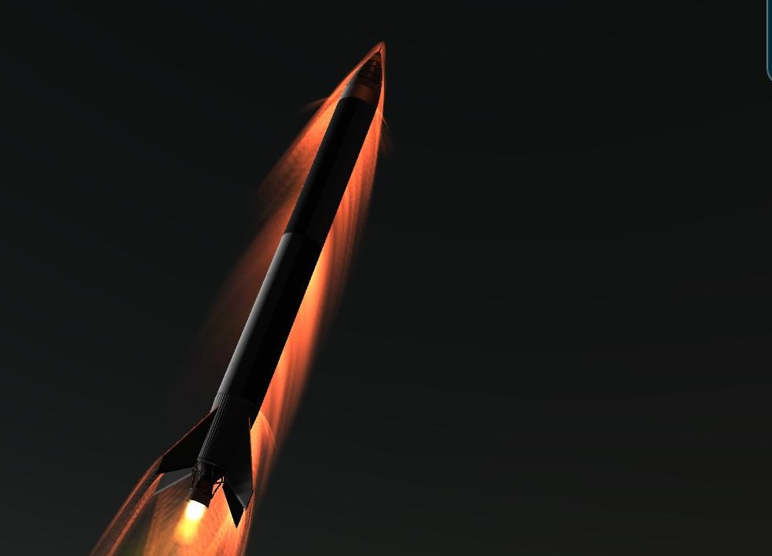

## Taking the pets with us

### 02 - 08 - 1951

|          |                |
|----------|----------------|
| **Launcher:** | [100 Crew](../lvs/100-crew.md) |
| **Payload:** | X-1 Bio |
| **Destination:** | Sub-Orbital |
| **Mission duration:** | Minutes |
| **Apogee:**| 195 km |
| **Downrange distance:** | not measured |
| **Maximum velocity:** | not measured |

