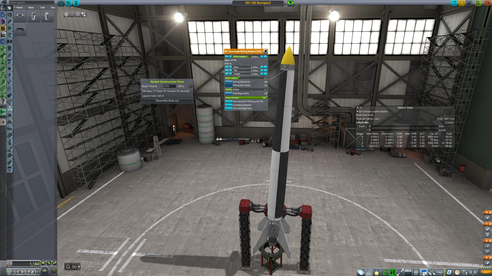

## Going wide and far

### 08 - 04 - 1951

|          |                |
|----------|----------------|
| **Destination:** | Sub-Orbital |
| **Mission duration:** | Minutes |
| **Apogee:**| above 600 km |
| **Downrange distance:** | just over 3000 km |
| **Maximum velocity:** | more than 4 km/s |

This mission was the first Orbital Lifting Vehicle development test, using a powerful pump-fed rocket engine as a first stage, and two WAC-Corporal engines in the second stage.
Using advanced ballistic models, the DPSP engineers managed to send it in an unguided trajectory with maximum range for the capabilities of this rocket.
This revolutionary design, with several firsts both in the technologies employed and in the flight profile, opened the way for the development of orbital rockets.

