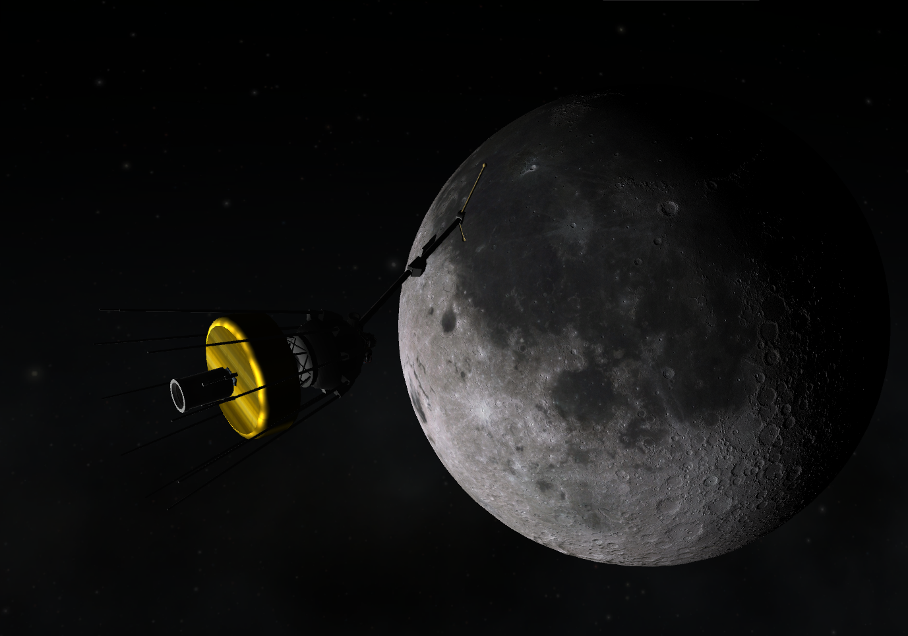

## To the Moon! (in pieces)

### 26 - 12 - 1953

|          |                |
|----------|----------------|
| **Launcher:** | [LV-1 T3](../lvs/lv1-t1) |
| **Payload:** | ST-1 Luna |
| **Destination:** | Lunar impact |
| **Mission duration:** | 1 day, 12 hours |
| **Parking orbit:**| 160x350 km |
| **Transit time:**| 1 day, 12 hours |
| **Launch date:**| 24 - 12 - 1953 |

**Mission acomplised:** First lunar flyby and First lunar impact

This mission 

