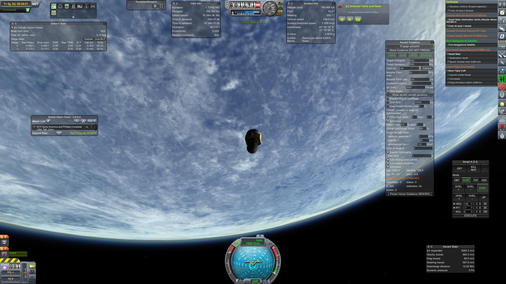

## First Navigaion Satellite

### 04 - 02 - 1953

|          |                |
|----------|----------------|
| **Launcher:** | [LV-1 T1](../lvs/lv1-t1) |
| **Payload:** | ST-0+100 Payload |
| **Destination:** | LEO |
| **Perigee:**| 334 km |
| **Apogee:**| 1175 km |
| **Inclination:** | 46° |

**Mission acomplised:** First navigation satellite

This mission 

