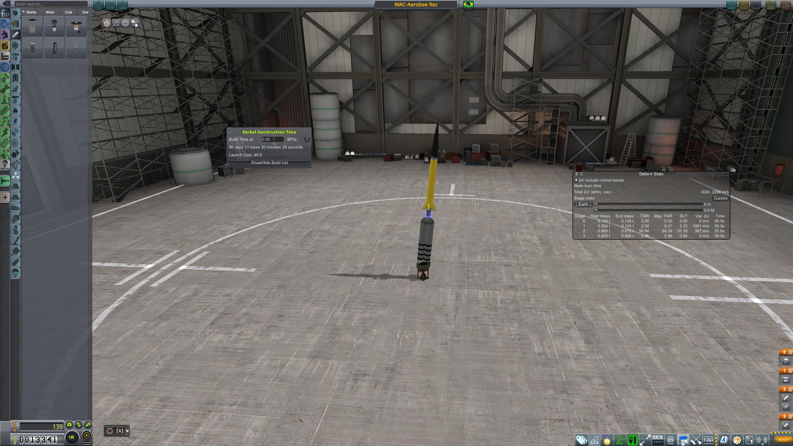

## Everything that goes up, comes down

### 07 - 03 - 1951
|          |                |
|----------|----------------|
| **Destination** | Sub-Orbital |
| **Mission duration** | Minutes |
| **Apogee:**| above 140 km |
| **Downrange distance:** | ~200 km |
| **Maximum velocity** | not measured |

Our [Recoverable Corporal-WAC](../lvs/corporal-wac-r.md), with twin tiny Tim boosters to give it a little bit more oomph, managed to reach space and return for a splash down on the ocean.
This opened up the possibility of sending people into space using a similar technique, and much bigger rockets.
