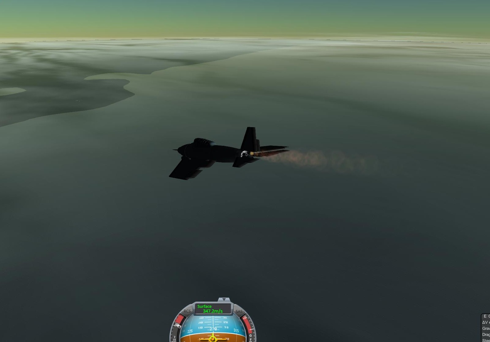

## Booom!

### 03 - 05 - 1951

|          |                |
|----------|----------------|
| **Launcher:** | NA |
| **Payload:** | [Junk proto](../lvs/junk.md) |
| **Destination:** | Atmospheric flight |
| **Mission duration:** | ~30 minutes |
| **Maximum altitude:**| 14 km |
| **Maximum velocity:** | 350 m/s |

Part PR stunt, part training for the DPSP selected pilots before the suborbital missions, this mission used a modified military fighter as rocket plane.
It had two WAC-Corporal engines added, and was designed to attain speeds close to 400m/s in a slight dive above 13km of altitude. 
The mission, however, was the first in the DPSP to be a partial failure. 

When pilot Henry Andrews pushed the button to activate the rocket engines, one of the engines failed to ignite. 
For the despair of the mission control urging him to shut down the remaining rocket and return to base, Henry kept on, getting into a much steeper dive than the mission parameters, in order to
break the sound barrier. Burning the remaining engine all the way until it shutdown from overburning, he managed to stay above the speed of sound for 
just above 30s and was officially recognized as the first Brazilian to break the sound barrier.

